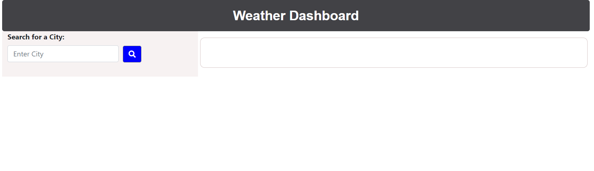
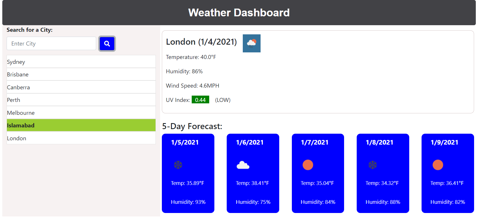
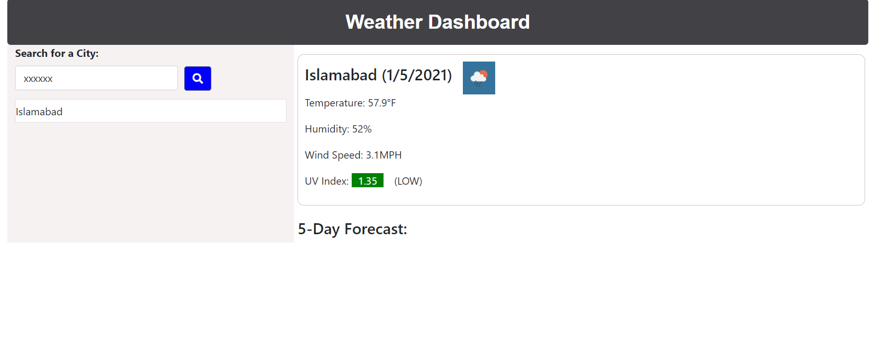

# Weather Dashboard

Use the [OpenWeather API](https://openweathermap.org/api) to retrieve weather data for cities.

## Project Notes

The UV index value color description can be found on the the following link: (https://en.wikipedia.org/wiki/Ultraviolet).

Upon opening the first time, the 'Default Condition' will appear as shown in the image below (weather-dashboard-default.PNG). The 'lastSearch' array in the user program and 'dashBoardUser' in the local storage are empty.

A demo of the working system is shown in the 'Demo' image shown below.

Provided a valid city is entered, the current weather and the forecasted weather for five days will be displayed. During this process, the user program will extract the city name from the actual API response, and push it in the 'lastSearch' array. The same array is copied dynamically in the local storage with 'dashBoardUser' key. Each time an addtional item is pushed in the 'lastSearch array', the 'dashBoardUser' item in the local storage will also be updated. To prevent double entry of cities, a validation logic is included to ensure that a given city is not saved more than once. When the system is refreshed, items from 'dashBoardUser' in the local storage will be copied back to 'lastSearch' array in the user program. If items are stored in 'dashBoardUser', the city on index 0 will be displayed.

If an invalid city is entered, the system will keep the last entered city (if there is already one) with no five day forecast as shown in the 'Invalid City' image below . The 'lastSearch' array and 'dashBoardUser' in the local storage will not be updated if a valid city is entered.

## The application could be accessed using the following link:
https://apolinar291076.github.io/Weather-Dashboard/

## The repo for the application could be accessed using the following link:
https://github.com/Apolinar291076/Weather-Dashboard.git

The following image demonstrates the application functionality:

### Default Condition

### Working Demo

### Invalid City

